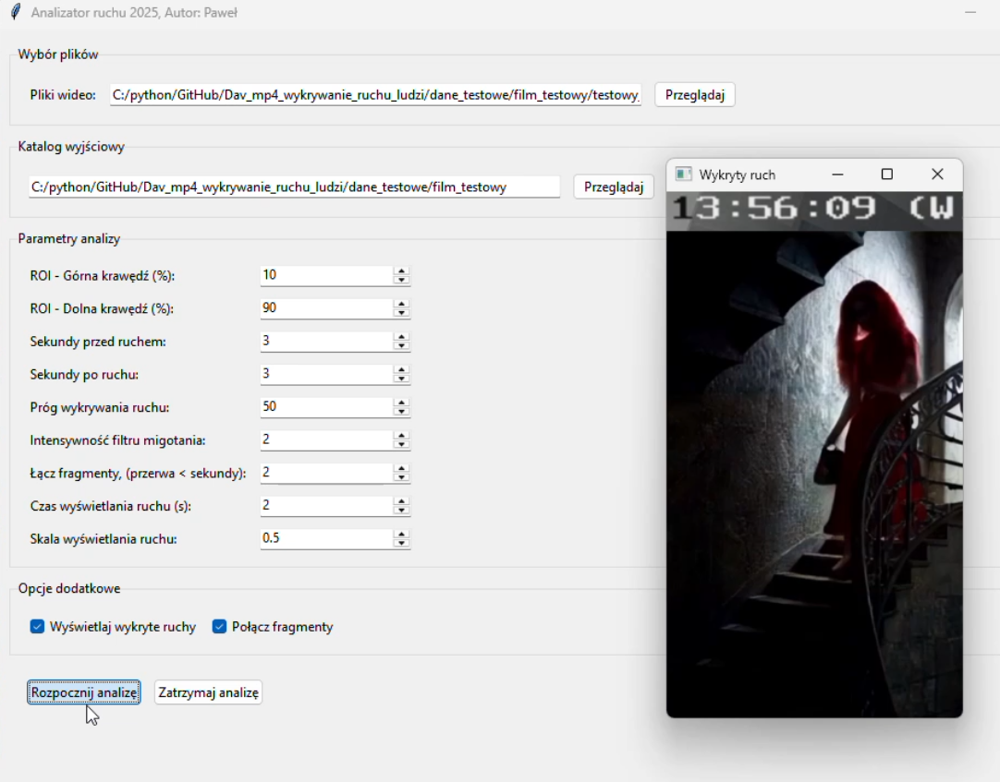
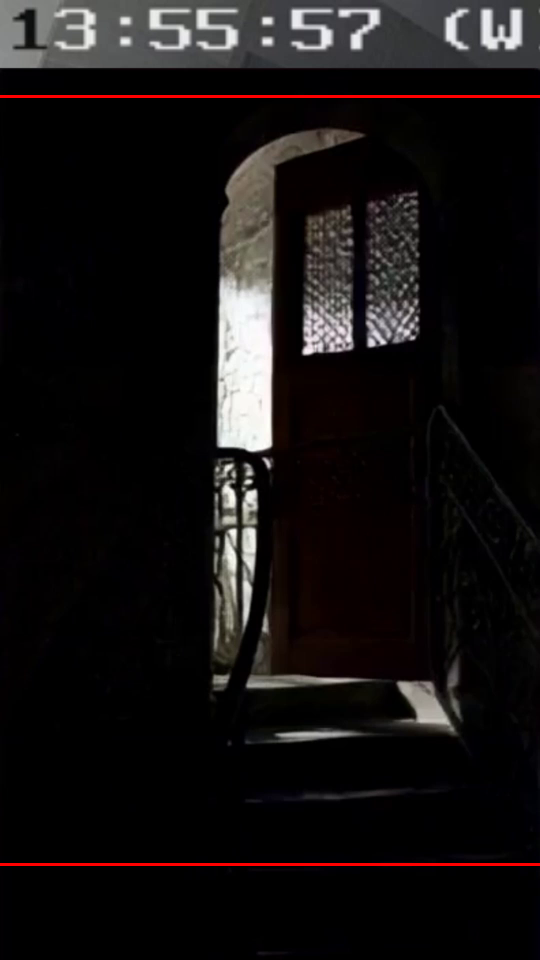
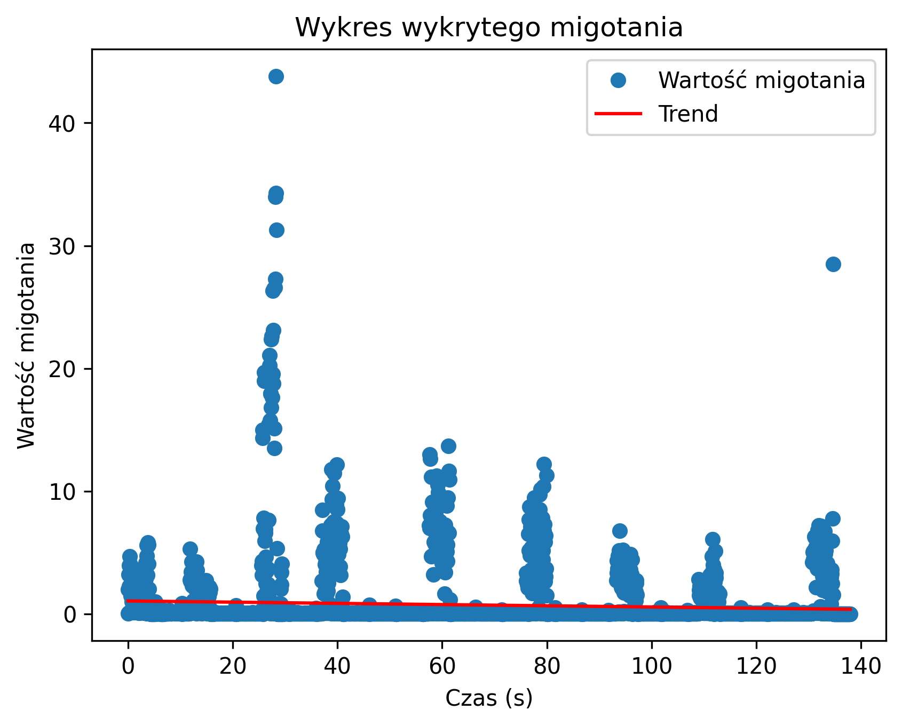

# Analizator ruchu 2025, Autor: Paweł

## Wprowadzenie

Analizator ruchu 2025 to zaawansowana aplikacja napisana w Pythonie, której celem jest analiza ruchu w nagraniach wideo. Program wykrywa ruch, generuje raporty (CSV, pliki tekstowe), tworzy wykresy oraz zestawia fragmenty wideo, w których wykryto aktywność. Projekt został zbudowany w sposób modułowy, co ułatwia rozwój i utrzymanie kodu.

## Struktura projektu

- **main.py** – główny punkt wejścia, który uruchamia testy diagnostyczne oraz interfejs użytkownika.
- **diagnostics.py** – moduł testujący poprawność importu zależności oraz funkcjonalność Tkintera.
- **video_processing.py** – zawiera funkcje do przetwarzania wideo: wykrywanie ruchu, filtrowanie, generowanie wykresów, łączenie fragmentów oraz eksport wyników.
- **ui.py** – interfejs użytkownika (oparty na Tkinter), gdzie można ustawiać parametry analizy (ROI, czas przed/po ruchem, próg wykrywania, czas wyświetlania wykrytego ruchu, skalę obrazu) oraz wybrać pliki do analizy.
- **merge_fragments.py** – skrypt do łączenia fragmentów wideo przy użyciu ffmpeg.
- **exe/** – katalog zawierający wersję EXE programu.
- **poprzednie_wersje_programu/** – katalog zawierający wcześniejsze wersje aplikacji (z mniejszą funkcjonalnością niż wersja końcowa).
- **dane_testowe/film_testowy/** – w tym folderze znajduje się plik `testowy_film.mp4`, który może posłużyć do testowania aplikacji. Wyniki analizy dla tego pliku zapisane są w katalogu `testowy_film`.

## Przykładowe Wyniki

### Interfejs użytkownika

Poniżej znajduje się zrzut ekranu interfejsu aplikacji:
  


Bezpośrednio pod interfejsem znajduje się obrazek pokazujący, jak wygląda **wyłączony obszar** (domyślnie ustawiony – np. góra ekranu, gdzie mogą pojawić się linie informujące o wyłączeniu części obrazu):



### Przykładowe wyniki analizy

Przykład wykresu migotania (akcji wykrytej w wideo). W tym przypadku po schodach przechodziło 9 osób w odstępach czasu:



## Instalacja i Uruchomienie

### Instalacja z GitHub

1. **Pobierz projekt, załóż środowisko i zainstaluj zależności**

Sklonuj repozytorium i wykonaj poniższe kroki w terminalu (np. CMD, PowerShell):

```bash
git clone https://github.com/legionowopawel/wykrywanie_ruchu_na_schodach.git
cd wykrywanie_ruchu

py -3.10 -m venv venv
venv\Scripts\activate

python --version
python -m pip install --upgrade pip
pip install -r requirements.txt
